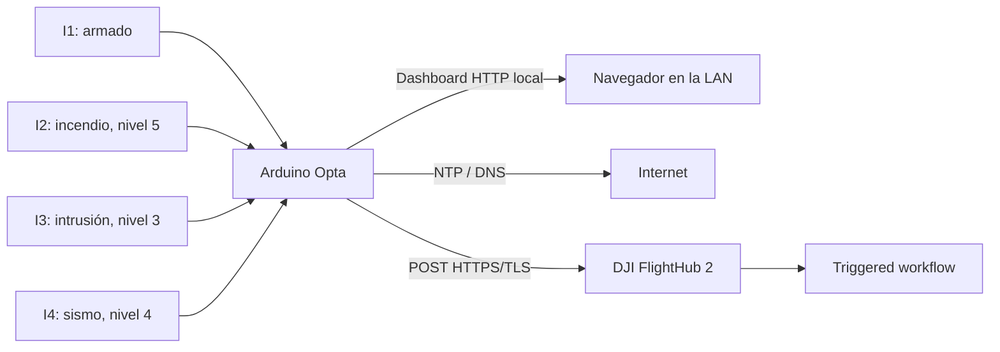

# Arduino Opta multibotón para DJI FlightHub 2

Integración de cuatro entradas físicas de un Arduino Opta WiFi AFX00002 con un
único triggered workflow de DJI FlightHub 2.

El firmware incorpora un dashboard Ethernet sin recargas, envío HTTPS/TLS,
sincronización NTP y protecciones contra activaciones accidentales.

## Entradas y niveles

| Entrada | Función | Nivel enviado |
|---|---|---:|
| I1 / A0 | Armado general | — |
| I2 / A1 | Incendio | 5 |
| I3 / A2 | Intrusión | 3 |
| I4 / A3 | Evento sísmico | 4 |

Cada evento utiliza el mismo `workflow_uuid`, pero tiene nombre, descripción,
nivel y coordenadas independientes. Los valores privados se guardan
exclusivamente en archivos ignorados por Git.

## Protecciones

- I1 debe permanecer en ON.
- Una entrada de evento debe permanecer estable durante dos segundos.
- I2, I3 e I4 deben liberarse antes de otra activación.
- Varias entradas activas simultáneamente bloquean el envío.
- Existe un cooldown global de 60 segundos en modo real.
- Los relevadores D0-D3 permanecen forzados en OFF.
- El dashboard sólo monitorea: no contiene controles de disparo.
- El repositorio arranca en DRY RUN.

## Arquitectura

## Inicio rápido

1. Instala Arduino IDE y **Arduino Mbed OS Opta Boards**.
2. Copia `arduino_secrets.example.h` como `arduino_secrets.h`.
3. Copia `fire_event_config.example.h` como `fire_event_config.h`.
4. Completa localmente credenciales, workflow, creator y coordenadas.
5. Conserva `FH2_LIVE_SEND_ENABLED = false`.
6. Compila y carga el sketch.
7. Abre el monitor serie a 115200 baud.
8. Visita `http://<IP-del-Opta>`.
9. Valida las tres entradas en DRY RUN.
10. Habilita el envío real solamente después de revisar el workflow.

Consulta la [guía de instalación](docs/02-instalacion.md) antes de cargar el
firmware.

## Estructura

- `firmware/opta_fh2_panel_multievento/`: sketch y plantillas.
- `docs/01-arquitectura-y-cableado.md`: hardware y conexiones.
- `docs/02-instalacion.md`: preparación y configuración privada.
- `docs/03-operacion-dashboard.md`: secuencia y panel web.
- `docs/04-api-y-prioridad.md`: JSON, niveles y alcance de la prioridad.
- `docs/05-plan-de-pruebas.md`: pruebas progresivas y criterios.
- `docs/06-troubleshooting.md`: diagnóstico de fallos frecuentes.
- `SECURITY.md`: manejo de secretos y seguridad operativa.

## Alcance de `level`

El firmware envía los niveles 5, 3 y 4 dentro de `params.level`. Esto demuestra
que el dato llega al workflow, pero no prueba que FlightHub 2 interrumpa o
reordene automáticamente misiones. Esa conducta debe definirse o verificarse
en el workflow y en un entorno de vuelo controlado.

## Advertencia

Este proyecto es una demostración. No sustituye un panel certificado de
incendio, intrusión, alerta sísmica, paro de emergencia ni seguridad funcional.
Un workflow puede provocar acciones físicas reales del dron.
